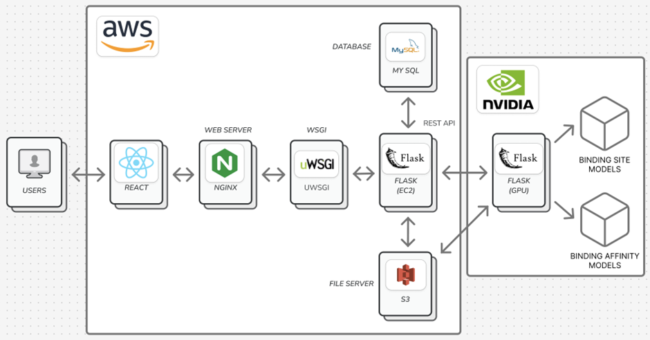
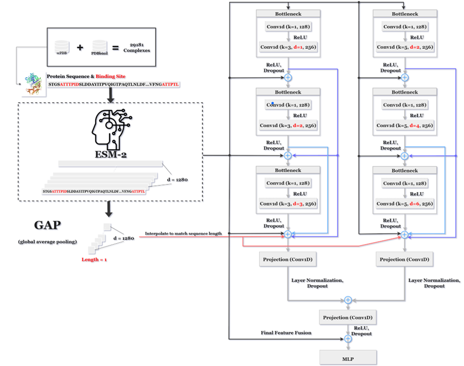
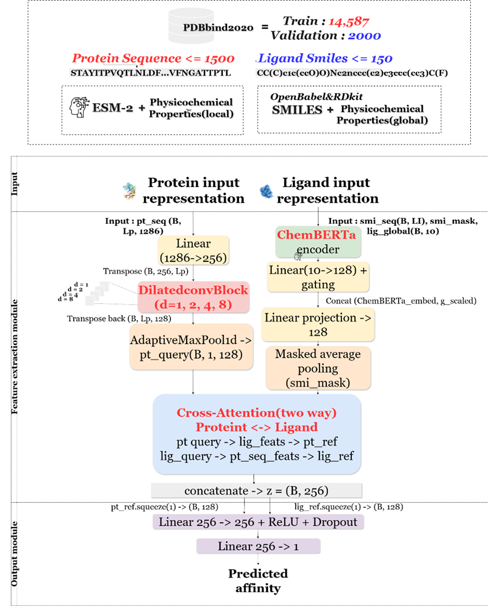
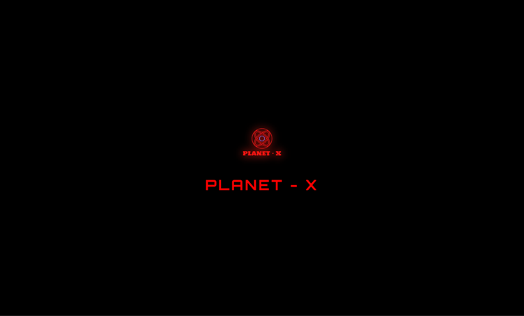
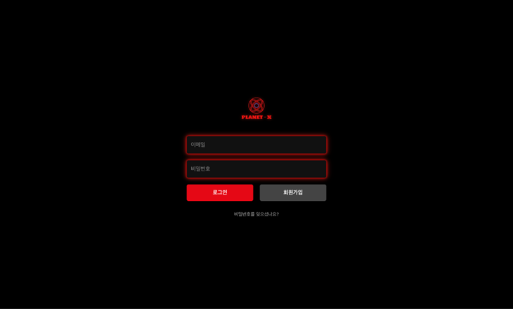
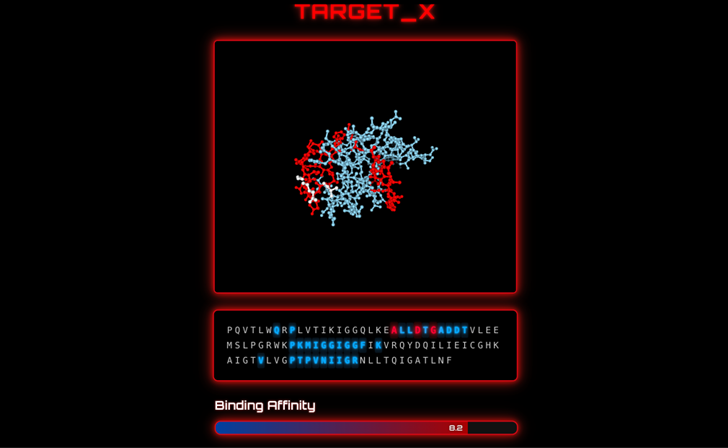

## 4. README.md 가이드 라인
- README 파일 작성시에 아래의 5가지 항목의 내용은 필수적으로 포함해야 합니다.
- 아래의 항목이외에 프로젝트의 이해를 돕기 위한 내용을 추가해도 됩니다.
- SAMPLE_README.md 이 단순한 형태의 예제이니 참고하세요.

```markdown
### 1. 프로젝트 배경
#### 1.1. 국내외 시장 현황 및 문제점
> 시장 조사 및 기존 문제점 서술

#### 1.2. 필요성과 기대효과
> 왜 이 프로젝트가 필요한지, 기대되는 효과 등

### 2. 개발 목표
#### 2.1. 목표 및 세부 내용
> 전체적인 개발 목표, 주요 기능 및 기획 내용
본 과제의 목표는 단백질과 리간드 간의 상호작용을 정밀하게 이해하기 위해, 단백질과 리간드 간의 결합 부위(binding site)와 결합 친화도(binding affinity)를 예측할 수 있는 딥러닝 기반의 예측 모델을 개발하는 데 있다. 이렇게 개발된 모델을 쉽게 활용할 수 있도록 웹페이지 형태의 인터페이스로 구현하여, 사용자들의 접근성과 편의성을 향상시키는 것을 목표로 한다. 특히, 실제 사용자 환경에서의 활용성을 고려하여, 서열 기반 모델 구현을 목표로 하였다.

#### 2.2. 기존 서비스 대비 차별성 
> 유사 서비스 비교 및 차별점 부각
Planet-X는 결합 부위 및 결합 친화도를 단백질 서열과 리간드 Smiles만으로 동시에 예측할 수 있으며 결합 부위를 시각적으로 포착할 수 있다는 점에서 차별성을 가진다.

#### 2.3. 사회적 가치 도입 계획 
> 프로젝트의 공공성, 지속 가능성, 환경 보호 등
신약 개발에 핵심적인... 에효
### 3. 시스템 설계
#### 3.1. 시스템 구성도
> 이미지 혹은 텍스트로 시스템 아키텍쳐 작성
>차례대로 웹 아키텍처, binding site 모델 아키텍처, binding affinity 모델 아키텍처이다.



#### 3.2. 사용 기술
> 프론트엔드, 백엔드, API 등 구체 기술 스택

### 4. 개발 결과
#### 4.1. 전체 시스템 흐름도
> 기능 흐름 설명 및 도식화 가능
>



#### 4.2. 기능 설명 및 주요 기능 명세서
> 주요 기능에 대한 상세 설명, 각 기능의 입력/출력 및 설명
>
#### 4.3. 디렉토리 구조
>
#### 4.4. 산업체 멘토링 의견 및 반영 사항
> 멘토 피드백과 적용한 사례 정리

### 5. 설치 및 실행 방법
>
#### 5.1. 설치절차 및 실행 방법
> 설치 명령어 및 준비 사항, 실행 명령어, 포트 정보 등
#### 5.2. 오류 발생 시 해결 방법
> 선택 사항, 자주 발생하는 오류 및 해결책 등

### 6. 소개 자료 및 시연 영상
#### 6.1. 프로젝트 소개 자료
> PPT 등
#### 6.2. 시연 영상
> 영상 링크 또는 주요 장면 설명

### 7. 팀 구성
#### 7.1. 팀원별 소개 및 역할 분담
>
#### 7.2. 팀원 별 참여 후기
> 개별적으로 느낀 점, 협업, 기술적 어려움 극복 사례 등

### 8. 참고 문헌 및 출처
[1] A. Vaswani, L. Jones, N. Shazeer, N. Parmar, A. N. Gomez, J. Uszkoreit, Ł. Kaiser, and I. Polosukhin, “Attention Is All You Need,” arXiv preprint arXiv:1706.03762, Aug. 2023. [Online]. Available: https://arxiv.org/abs/1706.03762
[2] A. Morehead and J. Cheng, “FlowDock: Geometric Flow Matching for Generative Protein-Ligand Docking and Affinity Prediction,” arXiv preprint arXiv:2412.10966, Mar. 2025.
[3] Z. Jin, T. Wu, T. Chen, D. Pan, X. Wang, J. Xie, L. Quan, and Q. Lyu, “CAPLA: improved prediction of protein–ligand binding affinity by a deep learning approach based on across-attention mechanism,” Briefings in Bioinformatics, vol. 24, no. 1, pp. 1–9, Jan. 2023. doi: 10.1093/bib/bbac534
[4] H. Öztürk, E. Ozkirimli, and A. Özgür, “DeepDTA: Deep drug-target binding affinity prediction,” arXiv preprint arXiv:1801.10193, Jan. 2018.
[5] K. Wang, R. Zhou, Y. Li, and M. Li, “DeepDTAF: A deep learning method to predict protein–ligand binding affinity,” School of Computer Science and Engineering, Central South University, Changsha, China, 2020.
[6] X. Zhang, H. Gao, H. Wang, Z. Chen, Z. Zhang, X. Chen, Y. Li, Y. Qi, and R. Wang, “PLANET: A Multi-objective Graph Neural Network Model for Protein-Ligand Binding Affinity Prediction,” J. Chem. Inf. Model., vol. 64, pp. 2205–2222, 2024.
[7] Y. Wang, Q. Jiao, J. Wang, X. Cai, W. Zhao, and X. Cui, “Prediction of protein-ligand binding affinity with deep learning,” Comput. Struct. Biotechnol. J., vol. 21, pp. 123–135, Nov. 2023. doi: 10.1016/j.csbj.2023.11.009
[8] S. Xu, L. Shen, M. Zhang, C. Jiang, X. Zhang, Y. Xu, J. Liu, and X. Liu, “Surface-based multimodal protein–ligand binding affinity prediction,” Bioinformatics, vol. 40, no. 7, btae413, Jul. 2024. doi: 10.1093/bioinformatics/btae413
[9] M.-H. Wu, Z. Xie, and D. Zhi, “Protein-ligand binding affinity prediction: Is 3D binding pose needed?” Communications Chemistry, vol. 8, no. 2, pp. 1–10, Mar. 2025. doi: 10.1038/s42004-025-01506-1
[10] I. Lee and H. Nam, “Highlights on Target Sequences (HoTS): Predicting protein–ligand binding regions based on sequence-only information,” Briefings in Bioinformatics, vol. 24, no. 1, bbac534, Jan. 2023. doi: 10.1093/bib/bbac534
[11] J. Chen, M. Guo, X. Wang, B. Liu, and J. Zhang, “Pseq2Sites: Sequence-based prediction of protein–ligand binding residues with deep learning,” Bioinformatics, vol. 38, no. 15, pp. 3622–3629, Aug. 2022. doi: 10.1093/bioinformatics/btac390
[12] K. He, X. Zhang, S. Ren, and J. Sun, “Deep residual learning for image recognition,” in Proc. IEEE Conf. Computer Vision and Pattern Recognition (CVPR), Las Vegas, NV, USA, 2016, pp. 770–778. doi: 10.1109/CVPR.2016.90
[13] L.-C. Chen, G. Papandreou, I. Kokkinos, K. Murphy, and A. L. Yuille, “DeepLab: Semantic image segmentation with deep convolutional nets, atrous convolution, and fully connected CRFs,” IEEE Trans. Pattern Anal. Mach. Intell., vol. 40, no. 4, pp. 834–848, 2018. doi: 10.1109/TPAMI.2017.2699184
[14] M. Yang, K. Yu, C. Zhang, Z. Li, and K. Yang, “DenseASPP for semantic segmentation in street scenes,” in Proc. IEEE Conf. Computer Vision and Pattern Recognition (CVPR), Salt Lake City, UT, USA, 2018, pp. 3684–3692. doi: 10.1109/CVPR.2018.00389
[15] Y. Chen, X. Li, Z. Wang, and J. Zhou, “UniAMP: enhancing AMP prediction using deep neural networks with inferred information of peptides,” BMC Bioinformatics, vol. 26, no. 1, p. 112, 2025. doi: 10.1186/s12859-025-1234-5
[16] I. Loshchilov and F. Hutter, “Decoupled weight decay regularization,” in Proc. International Conference on Learning Representations (ICLR), New Orleans, LA, USA, 2019. [Online]. Available: https://arxiv.org/abs/1711.05101

```

## 5. README.md 작성팁 
* 마크다운 언어를 이용해 README.md 파일을 작성할 때 참고할 수 있는 마크다운 언어 문법을 공유합니다.  
* 다양한 예제와 보다 자세한 문법은 [이 문서](https://www.markdownguide.org/basic-syntax/)를 참고하세요.

### 5.1. 헤더 Header
```
# This is a Header 1
## This is a Header 2
### This is a Header 3
#### This is a Header 4
##### This is a Header 5
###### This is a Header 6
####### This is a Header 7 은 지원되지 않습니다.
```
<br />

### 5.2. 인용문 BlockQuote
```
> This is a first blockqute.
>	> This is a second blockqute.
>	>	> This is a third blockqute.
```
> This is a first blockqute.
>	> This is a second blockqute.
>	>	> This is a third blockqute.
<br />

### 5.3. 목록 List
* **Ordered List**
```
1. first
2. second
3. third  
```
1. first
2. second
3. third
<br />

* **Unordered List**
```
* 하나
  * 둘

+ 하나
  + 둘

- 하나
  - 둘
```
* 하나
  * 둘

+ 하나
  + 둘

- 하나
  - 둘
<br />

### 5.4. 코드 CodeBlock
* 코드 블럭 이용 '``'
```
여러줄 주석 "```" 이용
"```
#include <stdio.h>
int main(void){
  printf("Hello world!");
  return 0;
}
```"

단어 주석 "`" 이용
"`Hello world`"

* 큰 따움표(") 없이 사용하세요.
``` 
<br />

### 5.5. 링크 Link
```
[Title](link)
[부산대학교 정보컴퓨터공학부](https://cse.pusan.ac.kr/cse/index..do)

<link>
<https://cse.pusan.ac.kr/cse/index..do>
``` 
[부산대학교 정보컴퓨터공학부](https://cse.pusan.ac.kr/cse/index..do)

<https://cse.pusan.ac.kr/cse/index..do>
<br />

### 5.6. 강조 Highlighting
```
*single asterisks*
_single underscores_
**double asterisks**
__double underscores__
~~cancelline~~
```
*single asterisks* <br />
_single underscores_ <br />
**double asterisks** <br />
__double underscores__ <br />
~~cancelline~~  <br />
<br />

### 5.7. 이미지 Image
```
</img>

```
- 웹에서 작성한다면 README.md 내용 안으로 이미지를 드래그 앤 드롭하면 이미지가 생성됩니다.
- 웹이 아닌 로컬에서 작성한다면, github issue에 이미지를 드래그 앤 드롭하여 image url 을 얻을 수 있습니다. (URL만 복사하고 issue는 제출 안 함.)
  
  


### 5.8. 유튜브 영상 추가
```markdown
[](유튜브 영상 URL)
[](https://www.youtube.com/watch?v=zh_gQ_lmLqE)    
```
[](https://www.youtube.com/watch?v=zh_gQ_lmLqE)    

- 이때 유튜브 영상 썸네일 URL은 유투브 영상 URL로부터 다음과 같이 얻을 수 있습니다.

- `Youtube URL`: https://www.youtube.com/watch?v={동영상 ID}
- `Youtube Thumbnail URL`: http://img.youtube.com/vi/{동영상 ID}/0.jpg 
- 예를 들어, https://www.youtube.com/watch?v=zh_gQ_lmLqE 라고 하면 썸네일의 주소는 http://img.youtube.com/vi/zh_gQ_lmLqE/0.jpg 이다.

