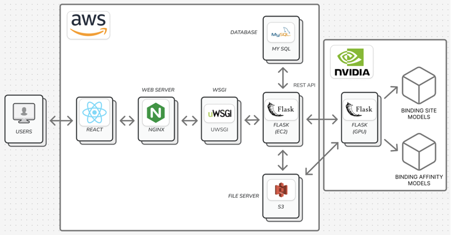
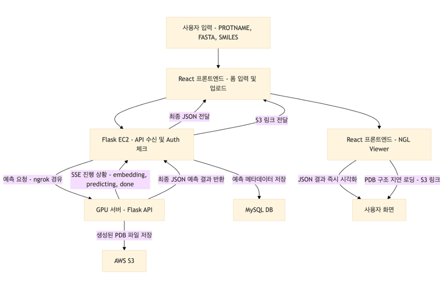
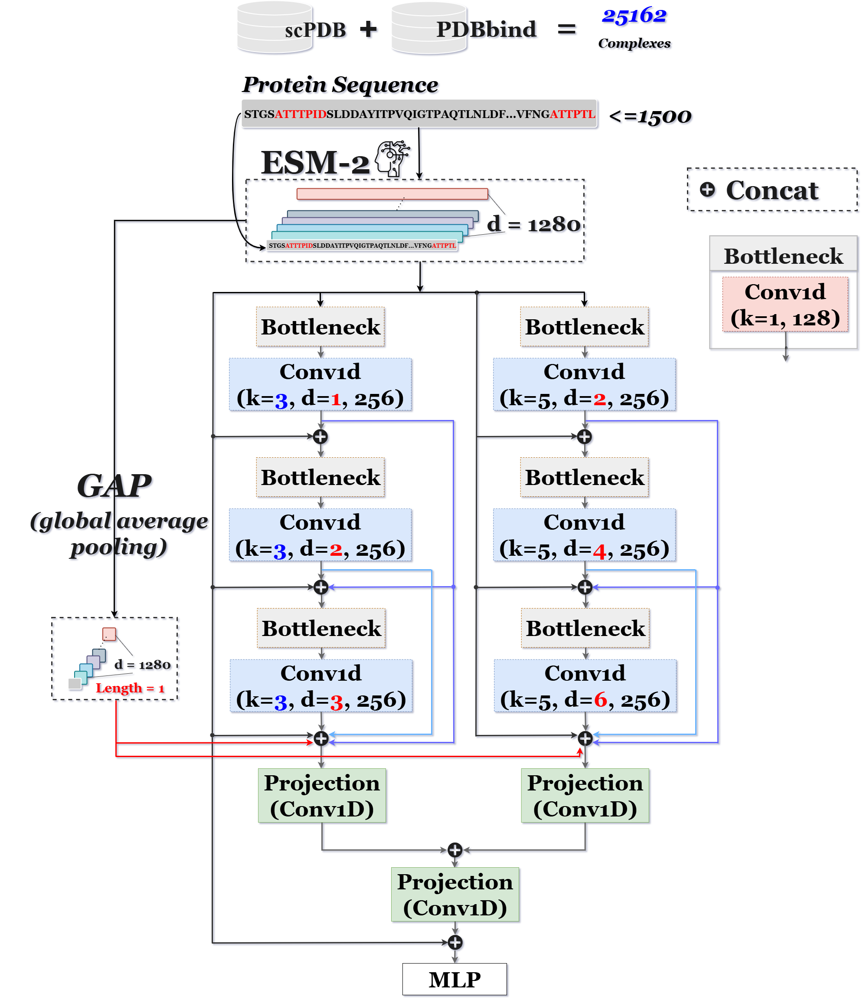
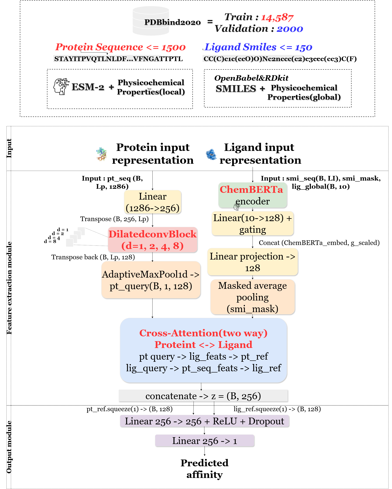

  
# PLaNet-X: Protein sequence-based Ligand binding-site and binding-affinity prediction via the deep convolutional network

### 1. 프로젝트 배경
신약 개발 과정에서 가장 중요한 단계 중 하나는 단백질과 리간드의 결합 메커니즘을 이해하는 것이다.

* 결합 부위(binding site)를 정확히 예측하면 탐색 공간을 줄여 계산 비용을 절감하고, 구조 기반 도킹의 효율성을 높일 수 있다.
* 결합 친화도(binding affinity)는 결합의 강도를 나타내며 약물 효능 평가의 핵심 지표가 된다.

기존 연구들은 주로 단백질의 3차원 구조를 기반으로 했기 때문에, 구조 확보에 많은 비용과 시간이 소요되는 한계가 있었다. 이에 따라 서열 기반 접근법이 최근 활발히 연구되고 있으며, 본 프로젝트에서는 이를 바탕으로 결합 부위와 결합 친화도를 동시에 예측하는 통합 모델을 제안한다.

***

### 2. 개발 목표
본 프로젝트에서는 단백질 서열 데이터를 기반으로 결합 부위와 결합 친화도를 동시에 예측하고, 예측된 결합 부위를 3D로 시각화할 수 있는 웹 서비스를 고안하였다. 이를 위해 결합 부위 예측 모델과 결합 친화도 예측 모델을 개발하고, 두 결과를 통합적으로 확인할 수 있는 웹 인터페이스를 구현하였다.

***

### 3. 필요성과 기대효과
본 프로젝트는 기존의 구조 기반 접근이 가지는 시간적·경제적 한계를 극복하고, 단백질 서열만으로도 결합 부위와 결합 친화도를 동시에 예측할 수 있는 새로운 방안을 제시한다.  

이를 통해:
- 신약 후보물질 발굴 과정에서 탐색 범위를 효과적으로 줄이고  
- 계산 비용을 절감하며  
- 예측 신뢰도를 높일 수 있다  

또한 구조 데이터가 없어도 서열 정보만으로 분석이 가능하므로, 활용 가능한 데이터의 범위가 크게 확대된다.  

특히, 결합 부위 예측과 친화도 평가를 한 번에 제공함으로써 연구자들이 보다 효율적으로 실험을 설계할 수 있고, 예측 결과를 3D로 시각화하여 직관적인 해석이 가능하다. 웹 서비스 형태로 구현함으로써 접근성과 편의성을 높였으며, 이는 여러 방면에서 폭넓은 활용이 가능할 것으로 기대된다.

***

### 4. 시스템 설계

#### 4.1. 시스템 구성도
- 입력: 단백질 서열, 리간드 SMILES  
- 처리: 전처리 모듈 → (결합 부위 예측 모델 + 결합 친화도 예측 모델) → 결과 후처리/시각화  
- 출력: 예측된 결합 부위(3D 시각화), 결합 친화도 값  

#### 4.2. 사용 기술
- **Frameworks**
  - PyTorch (모델 구현 및 학습)
  - HuggingFace Transformers (사전학습 모델 활용)

- **Libraries**
  - 단백질 임베딩: ESM-2
  - 리간드 임베딩: ChemBERTa
  - 리간드 전처리: RDKit, OpenBabel
  - 데이터 처리: NumPy, Pandas

***

### 5. 개발 결과

#### 5.1. 전체 시스템 흐름도
  

#### 5.2. 데이터 흐름도 및 모델 구
- **웹**
-   
- **결합 부위 예측 모델**
-   
- **결합 친화도 예측 모델**  
-   

#### 5.3. 디렉토리 구조
``` bash
♡ Capstone-2025-team-05
├── binding_site                        # Binding site prediction 모델
│   ├── modules                         # 세부 모듈 코드
│   │   ├── data.py                     # data 처리 helper 함수
│   │   ├── helpers.py                  # 보조 함수
│   │   ├── planet_x.py                 # binding_site 예측 모듈
│   │   ├── TrainIters.py               # train 관련 모듈
│   │   └── utils.py                    # 기타 유틸 함수
│   │
│   ├── results                         # 실행 결과
│   │   ├── CV                          # 교차검증 가중치 저장
│   │   └── prediction.tsv              # 예측값 저장
│   │
│   ├── configuration.yml               # config 파일
│   ├── gen_protein_embeddings.py       # 단백질 서열 ESM-2 임베딩 생성
│   ├── Preprocessing_coach420.ipynb    # Training dataset 전처리 (COACH420)
│   ├── Preprocessing_PDBbind.ipynb     # Training dataset 전처리 (PDBbind)
│   ├── Preprocessing_holo4k.ipynb      # Test dataset 전처리 (HOLO4K)
│   ├── Preprocessing_scPDB.ipynb       # Test dataset 전처리 (scPDB)
│   ├── test.py                         # 테스트 실행 스크립트
│   └── train.py                        # 학습 실행 스크립트
│
├── binding_affinity                    # Binding affinity prediction 모델
│   ├─ best/                            # 최종 best 모델 저장소
│   │  ├─ best2016_fp16.pt              # PDBbind2016 데이터 학습 모델
│   │  ├─ best2020_fp16.pt              # PDBbind2020 데이터 학습 모델
│   │  └─ README.md                     # best 모델 관련 유의사항
│   │
│   ├─ datasets/                        # 전처리 관련 코드 
│   │  ├─ README.md                     # 전처리 코드 유의사항
│   │  │
│   │  ├─ CASF-2013/                    # CASF-2013 전처리 코드
│   │  │   ├─ PreEmbed_CASF-2013.ipynb
│   │  │   └─ Preprocessing_CASF-2013.ipynb
│   │  │
│   │  ├─ Core2016/                     # Core2016 전처리 코드
│   │  │   ├─ PreEmbed_Core2016.ipynb
│   │  │   └─ Preprocessing_Core2016.ipynb
│   │  │
│   │  ├─ CSAR-HiQ/                     # CSAR-HiQ 전처리 코드
│   │  │   ├─ PreEmbed_CSAR36.ipynb
│   │  │   └─ Preprocessing_CSAR36.ipynb
│   │  │   ├─ PreEmbed_CSAR51.ipynb
│   │  │   └─ Preprocessing_CSAR51.ipynb
│   │  │
│   │  ├─ train2016/                    # PDBbind train2016 전처리 코드
│   │  │   ├─ PreEmbed_train2016.ipynb
│   │  │   └─ Preprocessing_train2016.ipynb
│   │  │
│   │  ├─ train2020/                    # PDBbind train2020 전처리 코드
│   │  │   ├─ PreEmbed_train2020.ipynb
│   │  │   └─ Preprocessing_train2020.ipynb
│   │  │
│   │  ├─ validation2016/               # PDBbind validation2016 전처리 코드
│   │  │   ├─ PreEmbed_validation2016.ipynb
│   │  │   └─ Preprocessing_validation2016.ipynb
│   │  │
│   │  └─ validation2020/               # PDBbind validation2020 전처리 코드
│   │      ├─ PreEmbed_validation2020.ipynb
│   │      └─ Preprocessing_validation2020.ipynb
│   │
│   ├─ dataset.py                       # 데이터셋 로더/클래스 정의
│   ├─ eval.py                          # 평가 스크립트
│   ├─ metrics_utils.py                 # 성능 지표 계산 함수들
│   ├─ planet_bap.py                    # binding affinity prediction모델 (Planet-BAP) 정의
│   └─ train.py                         # 학습 실행 스크립트
│
└── docs                                # 보고서, 포스터, 발표자료


```
### 6. 설치 및 실행 방법

- **웹 서비스**  
- **Binding site model**  
- **Binding affinity model**  

```bash
# Binding-site 예측 모델 학습
python train.py -c configuration.yml

#Binding-site 예측 모델 검증
python test.py -c configuration.yml --no-labels

# Binding-affinity 예측 모델 학습
python train.py

# Binding-affinity 예측 모델 검증
python eval.py
```

### 7. 소개 자료 및 시연 영상
- 프로젝트 소개 자료 (PPT)
<link>
<docs/03.발표자료/발표자료.pptx>
    
- 시연 영상
[](https://www.youtube.com/watch?v=KX1Z7JPGk7Y)    

***

### 8. 팀 구성
- **juju♥**: 웹 인터페이스 개발 및 연동, 단백질·리간드 구조 시각화  
- **shu♥**: 결합 부위 예측 모델 개발  
- **dada♥**: 결합 친화도 예측 모델 개발  

***

### 9. 참고 문헌 및 출처
1. A. Vaswani et al., *Attention Is All You Need,* arXiv preprint arXiv:1706.03762, Aug. 2023. [Online]. Available: <https://arxiv.org/abs/1706.03762>  
2. A. Morehead and J. Cheng, *FlowDock: Geometric Flow Matching for Generative Protein-Ligand Docking and Affinity Prediction,* arXiv preprint arXiv:2412.10966, Mar. 2025.  
3. Z. Jin et al., *CAPLA: improved prediction of protein–ligand binding affinity by a deep learning approach based on across-attention mechanism,* Briefings in Bioinformatics, vol. 24, no. 1, pp. 1–9, Jan. 2023. doi: [10.1093/bib/bbac534](https://doi.org/10.1093/bib/bbac534)  
4. H. Öztürk et al., *DeepDTA: Deep drug-target binding affinity prediction,* arXiv preprint arXiv:1801.10193, Jan. 2018.  
5. K. Wang et al., *DeepDTAF: A deep learning method to predict protein–ligand binding affinity,* Central South University, 2020.  
6. X. Zhang et al., *PLANET: A Multi-objective Graph Neural Network Model for Protein-Ligand Binding Affinity Prediction,* J. Chem. Inf. Model., vol. 64, pp. 2205–2222, 2024.  
7. Y. Wang et al., *Prediction of protein-ligand binding affinity with deep learning,* Comput. Struct. Biotechnol. J., vol. 21, pp. 123–135, Nov. 2023. doi: [10.1016/j.csbj.2023.11.009](https://doi.org/10.1016/j.csbj.2023.11.009)  
8. S. Xu et al., *Surface-based multimodal protein–ligand binding affinity prediction,* Bioinformatics, vol. 40, no. 7, btae413, Jul. 2024. doi: [10.1093/bioinformatics/btae413](https://doi.org/10.1093/bioinformatics/btae413)  
9. M.-H. Wu et al., *Protein-ligand binding affinity prediction: Is 3D binding pose needed?* Communications Chemistry, vol. 8, no. 2, pp. 1–10, Mar. 2025. doi: [10.1038/s42004-025-01506-1](https://doi.org/10.1038/s42004-025-01506-1)  
10. I. Lee and H. Nam, *Highlights on Target Sequences (HoTS): Predicting protein–ligand binding regions based on sequence-only information,* Briefings in Bioinformatics, vol. 24, no. 1, Jan. 2023. doi: [10.1093/bib/bbac534](https://doi.org/10.1093/bib/bbac534)  
11. J. Chen et al., *Pseq2Sites: Sequence-based prediction of protein–ligand binding residues with deep learning,* Bioinformatics, vol. 38, no. 15, pp. 3622–3629, Aug. 2022. doi: [10.1093/bioinformatics/btac390](https://doi.org/10.1093/bioinformatics/btac390)  
12. K. He et al., *Deep residual learning for image recognition,* in Proc. IEEE Conf. CVPR, Las Vegas, NV, USA, 2016, pp. 770–778. doi: [10.1109/CVPR.2016.90](https://doi.org/10.1109/CVPR.2016.90)  
13. L.-C. Chen et al., *DeepLab: Semantic image segmentation with deep convolutional nets, atrous convolution, and fully connected CRFs,* TPAMI, vol. 40, no. 4, pp. 834–848, 2018. doi: [10.1109/TPAMI.2017.2699184](https://doi.org/10.1109/TPAMI.2017.2699184)  
14. M. Yang et al., *DenseASPP for semantic segmentation in street scenes,* in Proc. IEEE Conf. CVPR, Salt Lake City, UT, USA, 2018, pp. 3684–3692. doi: [10.1109/CVPR.2018.00389](https://doi.org/10.1109/CVPR.2018.00389)  
15. Y. Chen et al., *UniAMP: enhancing AMP prediction using deep neural networks with inferred information of peptides,* BMC Bioinformatics, vol. 26, no. 1, p. 112, 2025. doi: [10.1186/s12859-025-1234-5](https://doi.org/10.1186/s12859-025-1234-5)  
16. I. Loshchilov and F. Hutter, *Decoupled weight decay regularization,* in Proc. ICLR, New Orleans, LA, USA, 2019. [Online]. Available: <https://arxiv.org/abs/1711.05101>  
